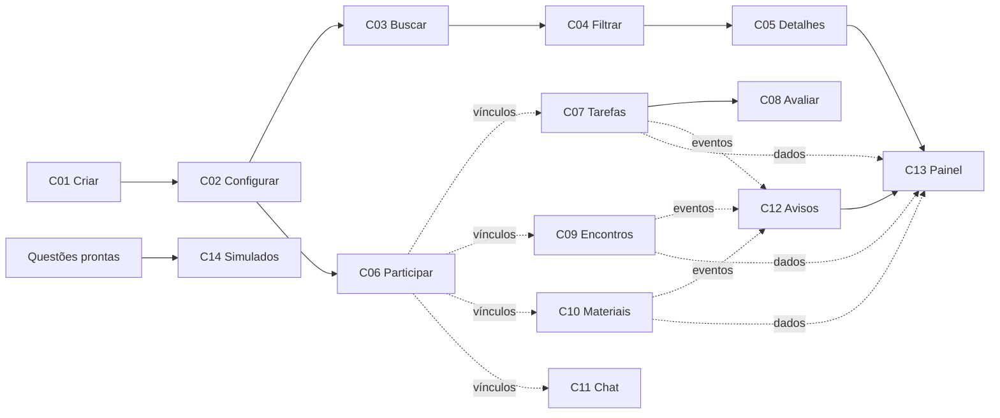

# Planejamento da Sprint

Arquitetura definida em [ARQUITETURA.md](ARQUITETURA.md); contratos prontos em [CONTRATOS.md](CONTRATOS.md). Este documento distribui todos os **14 cards reais de Backlog Ready**. Subtasks detalham esses cards e não são contadas como cards adicionais.

## Numeração dos cards

Os códigos C01–C14 seguem o fluxo de funcionalidades: configuração de grupos, descoberta e participação, atividades de estudo, colaboração e acompanhamento. Os mesmos números identificam as opções do menu, os módulos, as subtasks e as evidências. O número original do Trello aparece apenas como referência de origem.

| Código do projeto | Funcionalidade | Origem no Trello |
| --- | --- | --- |
| [C01](cards/C01.md) | Criar grupo de estudo | [#27](https://trello.com/c/4USVZAyt) |
| [C02](cards/C02.md) | Configurar características do grupo | [#28](https://trello.com/c/26ZPDZbJ) |
| [C03](cards/C03.md) | Procurar grupos por matéria | [#29](https://trello.com/c/oQQpkRr0) |
| [C04](cards/C04.md) | Filtrar grupos encontrados | [#30](https://trello.com/c/ZRxgmLJR) |
| [C05](cards/C05.md) | Visualizar detalhes do grupo | [#31](https://trello.com/c/GskvxBA0) |
| [C06](cards/C06.md) | Solicitar participação no grupo | [#32](https://trello.com/c/vKkAJK6n) |
| [C07](cards/C07.md) | Definir Tarefas e Metas de Estudo (em um grupo) | [#26](https://trello.com/c/yq8ilixQ) |
| [C08](cards/C08.md) | Receber Avaliação e Feedback de Grupos e Monitores | [#19](https://trello.com/c/h1qrfN0n) |
| [C09](cards/C09.md) | Marcar e alterar horário de encontro | [#37](https://trello.com/c/Nj7iriVP) |
| [C10](cards/C10.md) | Upload e Download de material de estudo | [#36](https://trello.com/c/rC9sqISv) |
| [C11](cards/C11.md) | Chat do Grupo | [#38](https://trello.com/c/wEEhqQ4l) |
| [C12](cards/C12.md) | Receber aviso de nova tarefa | [#9](https://trello.com/c/9te11vcG) |
| [C13](cards/C13.md) | Acessar painel de grupos | [#33](https://trello.com/c/PMg6epyP) |
| [C14](cards/C14.md) | Simulados gerados por IA | [#39](https://trello.com/c/DvZEf6vt) |

## Distribuição final

| Integrante | Cards e tasks detalhadas | Quantidade | Razão do agrupamento |
| --- | --- | ---: | --- |
| Pablo Abdon | [C07 Tarefas e metas](cards/C07.md), [C08 Avaliação e feedback](cards/C08.md), [C14 Simulados](cards/C14.md) | 3 | Permissões, datas, estado por participante, validação de respostas e maior complexidade; C08 depende de C07 |
| Bernardo Lins | [C03 Busca por matéria](cards/C03.md), [C04 Filtros](cards/C04.md), [C05 Detalhes](cards/C05.md) | 3 | Fluxo de descoberta inteiro com a mesma pessoa; três cards de menor dificuldade |
| Renan Gomes | [C01 Criar grupo](cards/C01.md), [C02 Configurar grupo](cards/C02.md) | 2 | Criação e ativação integradas, incluindo sobreposição do BDD original |
| Rafael Vergolino do Nascimento | [C12 Avisos](cards/C12.md), [C13 Meus Grupos](cards/C13.md) | 2 | Preferências e avisos usados no próprio painel |
| Enrique Araújo | [C10 Materiais](cards/C10.md), [C11 Chat](cards/C11.md) | 2 | Colaboração do grupo; arquivos locais e mensagens em memória |
| Alexandre Scalercio | [C06 Participação](cards/C06.md), [C09 Encontros](cards/C09.md) | 2 | Vínculos de participantes usados nos encontros |
| **Total** | **14 cards, todos os originais incluídos** | **14** | **Mínimo de dois por pessoa; diferença máxima de um** |

A dificuldade foi reavaliada para o MVP: chat sem tempo real e simulados sem IA real diminuem infraestrutura, mas simulados ainda exigem validação de retorno, respostas e entrega; por isso ficam com Pablo. Os pontos antigos não foram usados como critério de igualdade de quantidade.

Pablo também integra arquivos comuns e revisa os contratos. Esse trabalho de apoio não substitui nem aumenta artificialmente a contagem de cards funcionais.

## Dependências e desenvolvimento paralelo

| Card | Dependência funcional/de dados | Dependência de código no MVP | Como começar sem esperar |
| --- | --- | --- | --- |
| C01 | Usuário fictício | Base | Usuários já prontos |
| C02 | Grupo criado por C01 | Base; sem importar C01 | Configurar grupo 5 |
| C03 | Grupos ativos de C01/C02 | Base | Buscar grupos 1–3 |
| C04 | Resultado de C03 | A tela chama C03 | Passar lista dos grupos 1 e 2 à regra |
| C05 | Grupo de C01/C02 | Base | Consultar IDs das fixtures |
| C06 | Grupo ativo e vagas | Base | Diego entra em grupo 1 ou pede grupo 2 |
| C09 | Vínculos de C06 | Base de eventos | Bruno já participa do grupo 1 |
| C07 | Grupo e vínculos | Base de eventos | Criar atividades no grupo 1 |
| C08 | Atividades/atribuições de C07 | Base; sem importar C07 | Atribuições concluída, futura e expirada |
| C12 | Eventos de C07/C09/C10 | Base; sem importar produtores | Evento inicial e encontros prontos |
| C13 | Grupos, atividades, avisos, encontros, materiais | C05 para abrir detalhes; base para consultas | Ler coleções da fixture; testar navegação depois de C05 |
| C10 | Grupo e papéis | Base de eventos | Ana publica; Bruno baixa |
| C11 | Grupo e vínculos | Base | Ana e Bruno conversam |
| C14 | Questões e usuário | Provedor mock do próprio card | Fixture válida e inválida já prontas |

Setas mostram a composição da demonstração; não significam que todos precisam aguardar o código do antecessor. Grupos, vínculos e demais coleções já existem nas fixtures. Dependência de código que ainda não foi integrada impede apenas o respectivo teste integrado, não a implementação da regra isolada.

## Sequência sem prazo de entrega informado

1. **Base antes das tasks — preparada nesta entrega:** arquitetura, contratos, mocks, diretórios por card, menu com entradas e helpers pequenos. Fazer este commit chegar a todos antes de criarem branches.
2. **Primeira rodada em paralelo:** Renan C01; Bernardo C03; Alexandre C06; Rafael C12; Enrique C10; Pablo C07. Todos usam as fixtures e os contratos, sem esperar os demais.
3. **Segunda rodada em paralelo:** Renan C02; Bernardo C04/C05; Alexandre C09; Rafael C13; Enrique C11; Pablo C08/C14. Cada pessoa pode trabalhar em outra branch quando o primeiro card estiver pronto para revisão.
4. **Merges incrementais:** integrar cards independentes assim que revisados; dentro de cada sequência, preferir C01 antes de C02, C03 antes de C04 e C05, C07 antes de C08 e C05 antes da navegação final de C13. C14 pode entrar a qualquer momento.
5. **Integração final:** executar os fluxos em TESTES.md, corrigir divergências de contratos, atualizar os registros de testes e anexar evidências a cada card.

As rodadas são ordem sugerida de trabalho, não datas inventadas nem barreiras para toda a equipe. A Sprint está planejada para os 14 cards; se houver necessidade de reduzir, não retirar silenciosamente cards nem deixar alguém com menos de dois.

## Fluxo no quadro e critério de conclusão

`Backlog Ready → Em desenvolvimento → Em testes → Em validação → Backlog done`.

Em desenvolvimento: responsável implementa somente o escopo do card. Em testes: executa os cenários descritos, incluindo rejeições e dados que não podem mudar. Em validação: outra pessoa revisa o resultado e o PR; Pablo concentra mudanças em contratos e integrações. Em Backlog done: código integrado e funcionando, cenários executados, registros preenchidos, prints de sucesso/falha anexados ao card original e referência ao commit.

| Avaliação informada | Como o plano atende |
| --- | --- |
| Funcionalidades definidas na Sprint — 2/4 | 14 cards originais rastreados e divididos em subtasks, com entrega mínima explícita |
| Cenários de sucesso — 1/4 | Roteiro específico de sucesso para cada card e fluxos integrados |
| Cenários de falha — 1/4 | Rejeições, indisponibilidades simuladas ou resultados vazios, com resultado esperado |

Não produzir prints fictícios. As pastas de evidências estão vazias de imagens e os registros dizem **não executado** até o time testar as implementações. A verificação da estrutura inicial não conta como teste das funcionalidades.

## Aplicação da redistribuição

A distribuição acima é a nova atribuição proposta para o trabalho. O quadro foi usado como fonte de leitura; os cards e etiquetas existentes não foram alterados, nem comentários enviados. Os arquivos de cada card podem ser copiados para descrições/checklists do Trello pelo time. O planejamento mantém links para os cards de origem.
