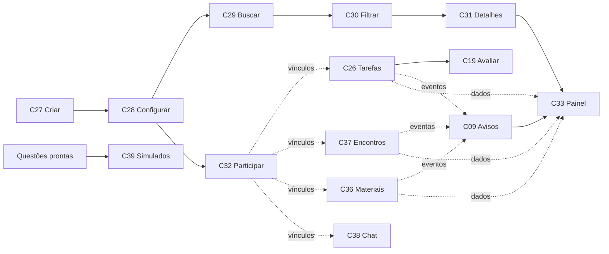

# Planejamento da Sprint

Arquitetura definida em [ARQUITETURA.md](ARQUITETURA.md); contratos prontos em [CONTRATOS.md](CONTRATOS.md). Este documento distribui todos os **14 cards reais de Backlog Ready**. Subtasks detalham esses cards e não são contadas como cards adicionais.

## Distribuição final

| Integrante | Cards e tasks detalhadas | Quantidade | Razão do agrupamento |
| --- | --- | ---: | --- |
| Pablo Abdon | [C26 Tarefas e metas](cards/C26.md), [C19 Avaliação e feedback](cards/C19.md), [C39 Simulados](cards/C39.md) | 3 | Permissões, datas, estado por participante, validação de respostas e maior complexidade; C19 depende de C26 |
| Bernardo Lins | [C29 Busca por matéria](cards/C29.md), [C30 Filtros](cards/C30.md), [C31 Detalhes](cards/C31.md) | 3 | Fluxo de descoberta inteiro com a mesma pessoa; três cards de menor dificuldade |
| Renan Gomes | [C27 Criar grupo](cards/C27.md), [C28 Configurar grupo](cards/C28.md) | 2 | Criação e ativação integradas, incluindo sobreposição do BDD original |
| Rafael Vergolino do Nascimento | [C09 Avisos](cards/C09.md), [C33 Meus Grupos](cards/C33.md) | 2 | Preferências e avisos usados no próprio painel |
| Enrique Araújo | [C36 Materiais](cards/C36.md), [C38 Chat](cards/C38.md) | 2 | Colaboração do grupo; arquivos locais e mensagens em memória |
| Alexandre Scalercio | [C32 Participação](cards/C32.md), [C37 Encontros](cards/C37.md) | 2 | Vínculos de participantes usados nos encontros |
| **Total** | **14 cards, todos os originais incluídos** | **14** | **Mínimo de dois por pessoa; diferença máxima de um** |

As etiquetas antigas do Trello foram ignoradas. A dificuldade foi reavaliada para o MVP: chat sem tempo real e simulados sem IA real diminuem infraestrutura, mas simulados ainda exigem validação de retorno, respostas e entrega; por isso ficam com Pablo. Os pontos antigos não foram usados como critério de igualdade de quantidade.

Pablo também integra arquivos comuns e revisa os contratos. Esse trabalho de apoio não substitui nem aumenta artificialmente a contagem de cards funcionais.

## Dependências e desenvolvimento paralelo

| Card | Dependência funcional/de dados | Dependência de código no MVP | Como começar sem esperar |
| --- | --- | --- | --- |
| C27 | Usuário fictício | Base | Usuários já prontos |
| C28 | Grupo criado por C27 | Base; sem importar C27 | Configurar grupo 5 |
| C29 | Grupos ativos de C27/C28 | Base | Buscar grupos 1–3 |
| C30 | Resultado de C29 | A tela chama C29 | Passar lista dos grupos 1 e 2 à regra |
| C31 | Grupo de C27/C28 | Base | Consultar IDs das fixtures |
| C32 | Grupo ativo e vagas | Base | Diego entra em grupo 1 ou pede grupo 2 |
| C37 | Vínculos de C32 | Base de eventos | Bruno já participa do grupo 1 |
| C26 | Grupo e vínculos | Base de eventos | Criar atividades no grupo 1 |
| C19 | Atividades/atribuições de C26 | Base; sem importar C26 | Atribuições concluída, futura e expirada |
| C09 | Eventos de C26/C37/C36 | Base; sem importar produtores | Evento inicial e encontros prontos |
| C33 | Grupos, atividades, avisos, encontros, materiais | C31 para abrir detalhes; base para consultas | Ler coleções da fixture; testar navegação depois de C31 |
| C36 | Grupo e papéis | Base de eventos | Ana publica; Bruno baixa |
| C38 | Grupo e vínculos | Base | Ana e Bruno conversam |
| C39 | Questões e usuário | Provedor mock do próprio card | Fixture válida e inválida já prontas |

Setas mostram a composição da demonstração; não significam que todos precisam aguardar o código do antecessor. Grupos, vínculos e demais coleções já existem nas fixtures. Dependência de código que ainda não foi integrada impede apenas o respectivo teste integrado, não a implementação da regra isolada.

## Sequência sem prazo de entrega informado

1. **Base antes das tasks — preparada nesta entrega:** arquitetura, contratos, mocks, diretórios por card, menu com entradas e helpers pequenos. Fazer este commit chegar a todos antes de criarem branches.
2. **Primeira rodada em paralelo:** Renan C27; Bernardo C29; Alexandre C32; Rafael C09; Enrique C36; Pablo C26. Todos usam as fixtures e os contratos, sem esperar os demais.
3. **Segunda rodada em paralelo:** Renan C28; Bernardo C30/C31; Alexandre C37; Rafael C33; Enrique C38; Pablo C19/C39. Cada pessoa pode trabalhar em outra branch quando seu primeiro card estiver pronto para revisão.
4. **Merges incrementais:** integrar cards independentes assim que revisados; dentro de cada sequência, preferir C27 antes de C28, C29 antes de C30 e C31, C26 antes de C19 e C31 antes da navegação final de C33. C39 pode entrar a qualquer momento.
5. **Integração final:** executar os fluxos em TESTES.md, corrigir divergências de contratos, atualizar os registros de testes e anexar evidências a cada card.

As rodadas são ordem sugerida de trabalho, não datas inventadas nem barreiras para toda a equipe. A Sprint está planejada para os 14 cards; se houver necessidade de reduzir, não retirar silenciosamente cards nem deixar alguém com menos de dois.

## Fluxo no quadro e critério de conclusão

`Backlog Ready → Em desenvolvimento → Em testes → Em validação → Backlog done`.

Em desenvolvimento: responsável implementa somente o escopo do card. Em testes: executa os cenários descritos, incluindo rejeições e dados que não podem mudar. Em validação: outra pessoa revisa o resultado e o PR; Pablo concentra mudanças em contratos e integrações. Em Backlog done: código integrado e funcionando, cenários executados, registros preenchidos, prints de sucesso/falha anexados ao card original e referência ao commit.

| Avaliação informada | Como o plano atende |
| --- | --- |
| Funcionalidades definidas na Sprint — 2/4 | 14 cards originais rastreados e divididos em subtasks, com entrega mínima explícita |
| Cenários de sucesso — 1/4 | Roteiro específico de sucesso para cada card e fluxos integrados |
| Cenários de falha — 1/4 | Rejeições, indisponibilidades simuladas ou resultados vazios, com resultado esperado |

Não produzir prints fictícios. As pastas de evidências estão vazias de imagens e seus registros dizem **não executado** até o time testar as implementações. A verificação da estrutura inicial não conta como teste das funcionalidades.

## Aplicação da redistribuição

A distribuição acima é a nova atribuição proposta para o trabalho. O quadro foi usado como fonte de leitura; os cards e etiquetas existentes não foram alterados, nem comentários enviados. Os arquivos de cada card podem ser copiados para descrições/checklists do Trello pelo time. O repositório público conterá o planejamento, sem o arquivo HTML inicial ou o token do convite.
